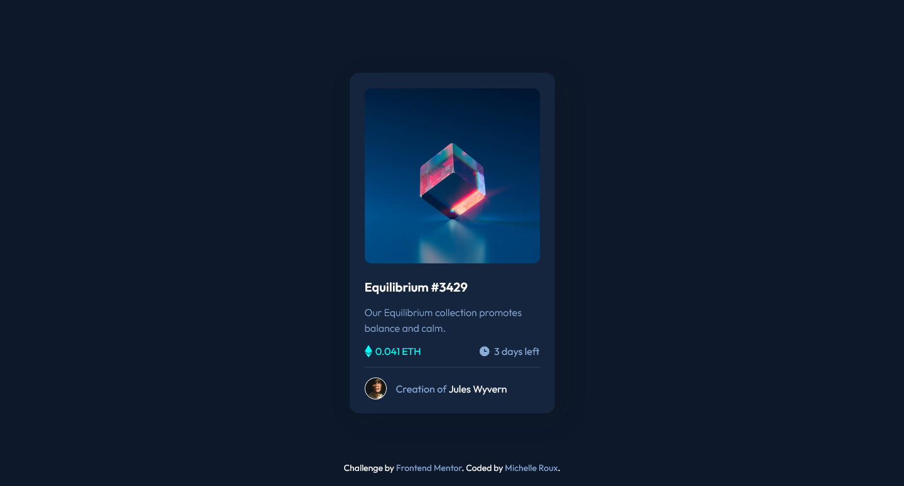

# Frontend Mentor - NFT preview card component solution

This is a solution to the [NFT preview card component challenge on Frontend Mentor](https://www.frontendmentor.io/challenges/nft-preview-card-component-SbdUL_w0U). Frontend Mentor challenges help you improve your coding skills by building realistic projects. 

## Table of contents

- [Overview](#overview)
  - [The challenge](#the-challenge)
  - [Screenshot](#screenshot)
  - [Links](#links)
- [My process](#my-process)
  - [Built with](#built-with)
  - [What I learned](#what-i-learned)
  - [Continued development](#continued-development)
- [Author](#author)
- [Acknowledgments](#acknowledgments)

## Overview

### The challenge

Users should be able to:

- View the optimal layout depending on their device's screen size
- See hover states for interactive elements

### Screenshot

### Links

- Solution URL: [click here](https://github.com/mcdulingm/NFT-preview-card)
- Live Site URL: [click here](https://mcdulingm.github.io/NFT-preview-card/)

## My process

I set my set styles and then build the structure of the card. I then connect the styling and structure from a mobile first approach.

### Built with

- Semantic HTML5 markup
- SASS/SCSS
- Flexbox
- Mobile-first workflow

### What I learned

I had to recall how to use after/before and hover/focus in SCSS. Very basic but if I don't do this everyday I have to go back and look it up.

### Continued development

I'm going to continue focusing on improving my SASS/SCSS.

## Author

- Frontend Mentor - [@mcdulingm](https://www.frontendmentor.io/profile/mcdulingm)

## Acknowledgments

Shout out to the future mentors in my life who will be helping me grow and improve my skills.
